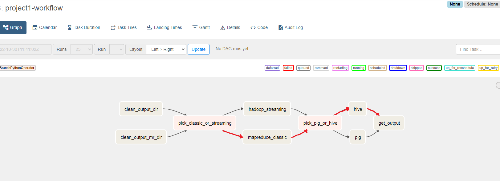

<h1 align="center">
    MapReduce, Hadoop Streaming, Pig, Hive, Apache Airflow - project
</h1>

## About
The main goal of the project was to analyse datasets avialable on: http://www.cs.put.poznan.pl/kjankiewicz/bigdata/projekt1 or https://www.imdb.com/interfaces/ and get the results for 3 genres among feature films (titleType=movie) with the most engaged actors. Final result presents 3 columns: genre, number of available films of that genre and number of actors who played a role in these films. The first task of the flow was to analyse `title.principals.tsv` file using `mapreduce` in the classic approach developed in `Java` and count number of actors for every film. The second task was to use `Hive` platform to generate final result based on mapreduce task result and `title.basics.tsv` file in the JSON format. The last task was to use `Apache Airflow` to orchestrate entire data workflow.

## Project Structure
Folder `MapReduceProject` contains the Java project for MapReduce task, `analyse_films.hql` script to create final result and `solution_script` which runs all the tasks. The file `projekt1.py` represents source code for a definition of the entire pipeline for data processing using `Apache Airflow`. Also the project has the compressed solution to test using Airflow available inside `projekt1.zip`. 

## Running the project
The project was created on `Google Cloud Platform`. To run the analyse it is necessary to load input data inside `projekt1/input/datasource1` and `projekt1/input/datasource4` folder on your existing bucket. Then you have to create cluster using for example command available inside `run_cluster.txt` file. Then you have to install and run `Apache Airflow` on that cluster and copy data from zipped file inside `airflow` folder. Then if you have configured the previous step in a proper way, solution should be available to test on your localhost. Running the pipeline you have to put your details about username and cluster name in Trigger config. The output of final task of the workflow should be identical to these in `result.txt` file. 

## DAG to represent data pipeline created by me from Apache Airflow UI
